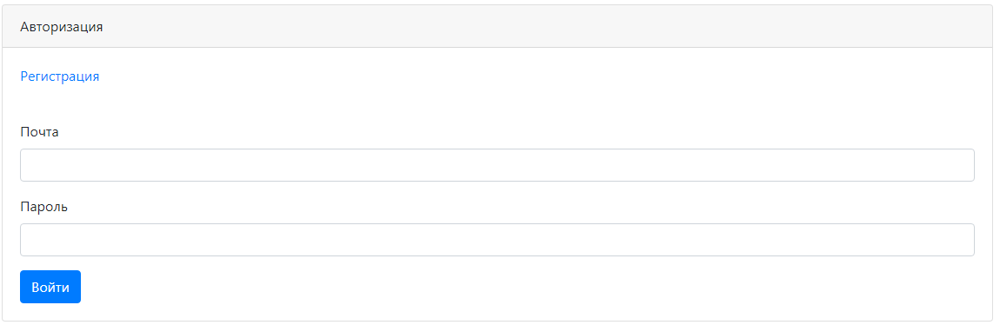
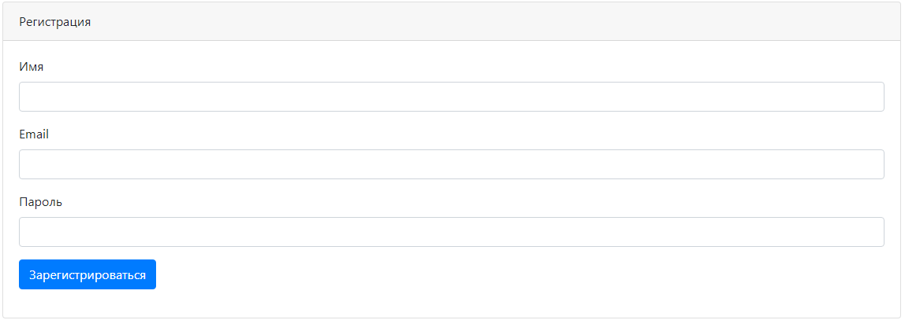
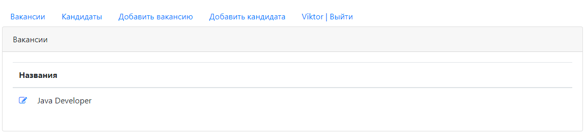
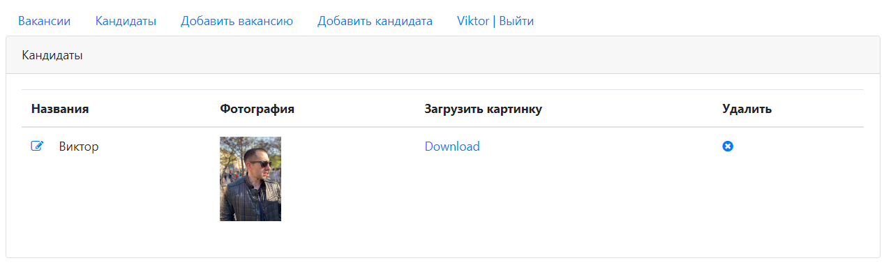
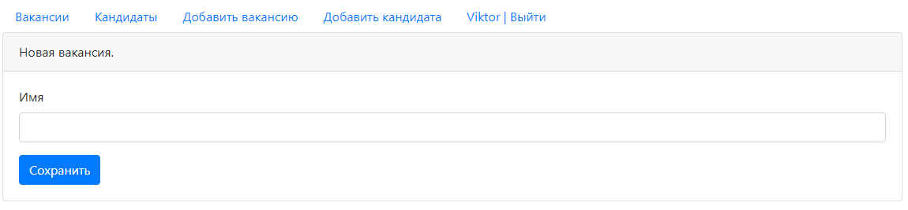
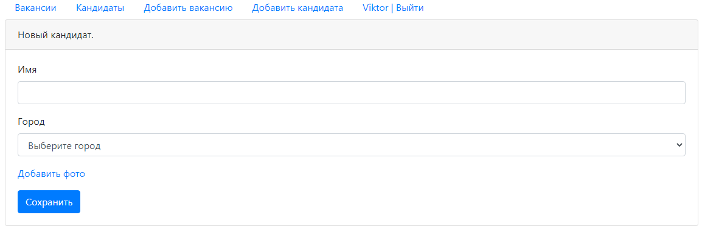

# job4j_dreamjob

## О проекте
Приложение для поиска сотрудников и работы.

## Стек
* Back-end
  * Java 15
  * Java EE Servlets
  * Apache Tomcat
  * Postgres
  * Maven
    
* Front-end
  * JS, Ajax
  * Jsp
  * HTML5
    
* Тесты
  * Mockito + PowerMock
    
## Возможности
* Авторизация/регистрация. Проверка полей на корректный ввод данных. Данные храняться в БД.
Без авторизации ограничен доступ к некоторым страницам с помощью фильтра.
* Создание/редактирование кандидатов/вакансий.
* Загрузка и скачивание изображений

## Демо

Страница входа в аккаунт

Страница регистрации

Страница вакансий

Страница кандидатов

Добавление вакансии

Добавление кандидата

## Контакты
Если у вас остались вопросы, вы можете связаться со мной. 
* Telegram: @vbgrishin